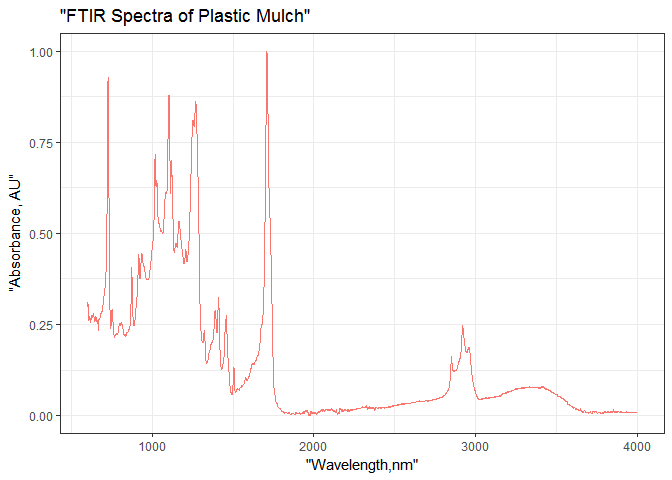
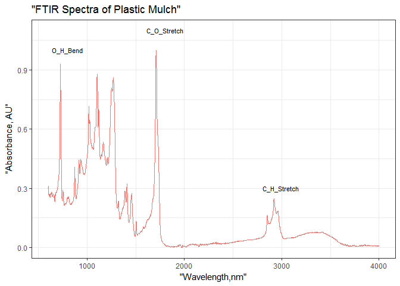

Attenuated Total Reflection-Fourier Transform Infrared Spectroscopy
================
Marife Anunciado
April 27, 2017

### Data Download & Conversion

Changes on the spectral intensities correlates to the formation and destruction of functional groups within the plastic films.Using the package FTIRAbsorbance, raw data (.csv file) generated directly from the instrument can be normalized through R without use of any data analysis software. Upon download of the original dataset, the table below shows the output with the original absorbance for each wavelength spectrum, using the code higlighted.

``` r
raw_a <- as.data.frame(mulch_plot)
knitr::kable(head(raw_a))
```

|    AU|  C\_38SAMPLE|  TNCleanMeshOrganixP205SAMPLE|  TNCleanMeshOrganixP205SAMPLE005|  TNCleanMeshOrganixP205SAMPLE006|  TNCleanMeshOrganixP205SAMPLE007|  TNCleanMeshOrganixP205SAMPLE008|  TNCleanMeshOrganixP205SAMPLE009|  TNCleanMeshOrganixP205SAMPLE010|  TNCleanMeshOrganixP205SAMPLE011|  TNCleanMeshOrganixP205SAMPLE012|  TNCleanMeshOrganixP205SAMPLE013|  TNCleanMeshOrganixP205SAMPLE014|  TNCleanMeshOrganixP205SAMPLE015|
|-----:|------------:|-----------------------------:|--------------------------------:|--------------------------------:|--------------------------------:|--------------------------------:|--------------------------------:|--------------------------------:|--------------------------------:|--------------------------------:|--------------------------------:|--------------------------------:|--------------------------------:|
|  4000|       0.0125|                        0.0144|                           0.0167|                           0.0113|                           0.0113|                           0.0132|                           0.0117|                           0.0116|                           0.0157|                           0.0165|                           0.0114|                           0.0117|                           0.0161|
|  3999|       0.0125|                        0.0144|                           0.0167|                           0.0113|                           0.0113|                           0.0132|                           0.0116|                           0.0116|                           0.0157|                           0.0165|                           0.0114|                           0.0117|                           0.0161|
|  3998|       0.0124|                        0.0143|                           0.0167|                           0.0113|                           0.0113|                           0.0132|                           0.0116|                           0.0116|                           0.0157|                           0.0165|                           0.0114|                           0.0117|                           0.0161|
|  3997|       0.0123|                        0.0143|                           0.0167|                           0.0113|                           0.0113|                           0.0132|                           0.0117|                           0.0116|                           0.0157|                           0.0165|                           0.0114|                           0.0118|                           0.0161|
|  3996|       0.0123|                        0.0143|                           0.0167|                           0.0113|                           0.0113|                           0.0131|                           0.0117|                           0.0116|                           0.0156|                           0.0165|                           0.0114|                           0.0118|                           0.0161|
|  3995|       0.0123|                        0.0144|                           0.0167|                           0.0113|                           0.0113|                           0.0131|                           0.0117|                           0.0116|                           0.0156|                           0.0165|                           0.0114|                           0.0118|                           0.0161|

### Normalization and Row Mean Calculation

For each column, values were normalized. The cbind statement creates a new object/column of row means where "x" is the input matrix, row.means = rowMeans(x)" uses the rowMeans function to the matrix, and names the new column "row.means" so now we can make our new object with a column of row means. Since original wavelength values were converted as character, a new column "Wavelength" was added for plotting the absorbance purpose.

``` r
normalize_add_rowmeans <- function(x) {
  for (i in 1:ncol(x)) {
        x[,i] <- (x[,i]- min(x[,i], na.rm = TRUE)) / (max(x[,i],na.rm = TRUE)-min(x[,i], na.rm = TRUE))
      }
      x <- cbind(x,row.means = rowMeans(x)) 
      x <-  add_column(x, Wavelength = 4000:600)
} 
a <- as.data.frame(normalize_add_rowmeans(mulch_plot))
knitr::kable(head(a))
```

|         AU|  C\_38SAMPLE|  TNCleanMeshOrganixP205SAMPLE|  TNCleanMeshOrganixP205SAMPLE005|  TNCleanMeshOrganixP205SAMPLE006|  TNCleanMeshOrganixP205SAMPLE007|  TNCleanMeshOrganixP205SAMPLE008|  TNCleanMeshOrganixP205SAMPLE009|  TNCleanMeshOrganixP205SAMPLE010|  TNCleanMeshOrganixP205SAMPLE011|  TNCleanMeshOrganixP205SAMPLE012|  TNCleanMeshOrganixP205SAMPLE013|  TNCleanMeshOrganixP205SAMPLE014|  TNCleanMeshOrganixP205SAMPLE015|  row.means|  Wavelength|
|----------:|------------:|-----------------------------:|--------------------------------:|--------------------------------:|--------------------------------:|--------------------------------:|--------------------------------:|--------------------------------:|--------------------------------:|--------------------------------:|--------------------------------:|--------------------------------:|--------------------------------:|----------:|-----------:|
|  1.0000000|    0.0094232|                     0.0060176|                        0.0043373|                        0.0204173|                        0.0180562|                        0.0108388|                        0.0181442|                        0.0160141|                        0.0073989|                        0.0063913|                        0.0169237|                        0.0122028|                        0.0042179|  0.0821702|        4000|
|  0.9997059|    0.0094232|                     0.0060176|                        0.0043373|                        0.0204173|                        0.0180562|                        0.0108388|                        0.0170769|                        0.0160141|                        0.0073989|                        0.0063913|                        0.0169237|                        0.0122028|                        0.0042179|  0.0820730|        3999|
|  0.9994118|    0.0084808|                     0.0051580|                        0.0043373|                        0.0204173|                        0.0180562|                        0.0108388|                        0.0170769|                        0.0160141|                        0.0073989|                        0.0063913|                        0.0169237|                        0.0122028|                        0.0042179|  0.0819233|        3998|
|  0.9991176|    0.0075385|                     0.0051580|                        0.0043373|                        0.0204173|                        0.0180562|                        0.0108388|                        0.0181442|                        0.0160141|                        0.0073989|                        0.0063913|                        0.0169237|                        0.0132197|                        0.0042179|  0.0819838|        3997|
|  0.9988235|    0.0075385|                     0.0051580|                        0.0043373|                        0.0204173|                        0.0180562|                        0.0099356|                        0.0181442|                        0.0160141|                        0.0066590|                        0.0063913|                        0.0169237|                        0.0132197|                        0.0042179|  0.0818455|        3996|
|  0.9985294|    0.0075385|                     0.0060176|                        0.0043373|                        0.0204173|                        0.0180562|                        0.0099356|                        0.0181442|                        0.0160141|                        0.0066590|                        0.0063913|                        0.0169237|                        0.0132197|                        0.0042179|  0.0818859|        3995|

``` r
a <- as.data.frame(normalize_add_rowmeans(mulch_plot))
```

### Absorbance

The plot shows the FTIR absorbance spectra of plastic materials in the wavenumber from 4000-600. The code highlighted can be modified to display researcher's interest, as shown in the succeeding plot below.

``` r
plot_abs <- function(df, df_x, df_y, xname,yname,title) {
    df <- ggplot(df) + geom_line(aes(df_x,df_y, colour = "red")) +
      xlab(deparse(substitute(xname))) + #user can assign a name on the x-axis label
      ylab(deparse(substitute(yname))) + #user can assign a name on the y-axis label
      ggtitle(deparse(substitute(title))) + #user can assign a plot title 
      theme_bw() + theme(legend.position = "none") 
      df
    print(df)} 
```

``` r
plot_abs(a,a$Wavelength,a$C_38SAMPLE,xname = "Wavelength,nm", 
                   yname = "Absorbance, AU", title = "FTIR Spectra of Plastic Mulch") 
```



### Absorbance and Functional Groups

The plot below shows the absorbance of plastic materials on a particular wavelength with the acompanying compounds. Looking at the plot gives what possible bending and stretching might have occurred indicating changes on the properties of plastic materials.

``` r
plot_abs_compounds <- function(df, df_x, df_y, xname,yname, title)
{
    df <- ggplot(df) + 
    geom_line(aes(df_x,df_y, colour = "red")) +
    xlab(deparse(substitute(xname))) + #user can assign a name on the x-axis label
    ylab(deparse(substitute(yname))) + #user can assign a name on the y-axis label
    ggtitle(deparse(substitute(title))) + #user can assign a plot title 
    theme_bw() + theme(legend.position = "none") 
    df <- df +
    annotate("text", x= 1800, y=1.1, label="C_O_Stretch", size =3.0) 
    df <- df +   
    annotate("text", x = 800, y = 1.0, label="O_H_Bend", size =3.0)
    df <- df + 
    annotate("text", x= 2994, y=0.3, label="C_H_Stretch", size =3.0)
    df
    print(df)}
```

``` r
plot_abs_compounds(a,a$Wavelength,a$C_38SAMPLE,xname = "Wavelength,nm", 
                   yname = "Absorbance, AU", title = "FTIR Spectra of Plastic Mulch") 
```



### Conclusion

This package will be beneficial to any researcher who will be working on ATR-FTIR analysis.
