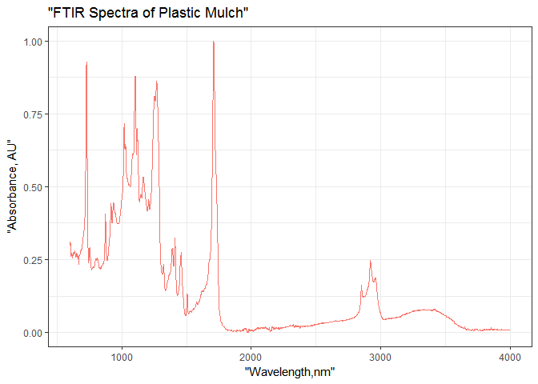
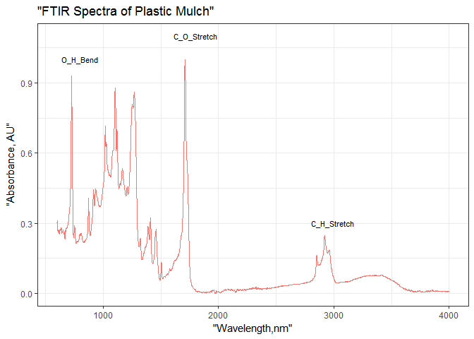

FTIR\_Absorbance
================
Marife Anunciado
April 27, 2017

#### For each column, values were normalized. The cbind statement creates a new object/column of row means where "x" is the input matrix, row.means = rowMeans(x)" uses the rowMeans function to the matrix, and names the new column "row.means" so now we can make our new object with a column of row means. Since original wavelength values were converted as character, a new column "Wavelength" was added for plotting the

absorbance purpose.

|         AU|  C\_38SAMPLE|  TNCleanMeshOrganixP205SAMPLE|  TNCleanMeshOrganixP205SAMPLE005|  TNCleanMeshOrganixP205SAMPLE006|  TNCleanMeshOrganixP205SAMPLE007|  TNCleanMeshOrganixP205SAMPLE008|  TNCleanMeshOrganixP205SAMPLE009|  TNCleanMeshOrganixP205SAMPLE010|  TNCleanMeshOrganixP205SAMPLE011|  TNCleanMeshOrganixP205SAMPLE012|  TNCleanMeshOrganixP205SAMPLE013|  TNCleanMeshOrganixP205SAMPLE014|  TNCleanMeshOrganixP205SAMPLE015|  row.means|  Wavelength|
|----------:|------------:|-----------------------------:|--------------------------------:|--------------------------------:|--------------------------------:|--------------------------------:|--------------------------------:|--------------------------------:|--------------------------------:|--------------------------------:|--------------------------------:|--------------------------------:|--------------------------------:|----------:|-----------:|
|  1.0000000|    0.0094232|                     0.0060176|                        0.0043373|                        0.0204173|                        0.0180562|                        0.0108388|                        0.0181442|                        0.0160141|                        0.0073989|                        0.0063913|                        0.0169237|                        0.0122028|                        0.0042179|  0.0821702|        4000|
|  0.9997059|    0.0094232|                     0.0060176|                        0.0043373|                        0.0204173|                        0.0180562|                        0.0108388|                        0.0170769|                        0.0160141|                        0.0073989|                        0.0063913|                        0.0169237|                        0.0122028|                        0.0042179|  0.0820730|        3999|
|  0.9994118|    0.0084808|                     0.0051580|                        0.0043373|                        0.0204173|                        0.0180562|                        0.0108388|                        0.0170769|                        0.0160141|                        0.0073989|                        0.0063913|                        0.0169237|                        0.0122028|                        0.0042179|  0.0819233|        3998|
|  0.9991176|    0.0075385|                     0.0051580|                        0.0043373|                        0.0204173|                        0.0180562|                        0.0108388|                        0.0181442|                        0.0160141|                        0.0073989|                        0.0063913|                        0.0169237|                        0.0132197|                        0.0042179|  0.0819838|        3997|
|  0.9988235|    0.0075385|                     0.0051580|                        0.0043373|                        0.0204173|                        0.0180562|                        0.0099356|                        0.0181442|                        0.0160141|                        0.0066590|                        0.0063913|                        0.0169237|                        0.0132197|                        0.0042179|  0.0818455|        3996|
|  0.9985294|    0.0075385|                     0.0060176|                        0.0043373|                        0.0204173|                        0.0180562|                        0.0099356|                        0.0181442|                        0.0160141|                        0.0066590|                        0.0063913|                        0.0169237|                        0.0132197|                        0.0042179|  0.0818859|        3995|

``` r
a <- as.data.frame(normalize_add_rowmeans(mulch_plot))
```

#### The plot only shows the absorbance of plastic materials on a particular wavelength.

``` r
plot_abs(a,a$Wavelength,a$C_38SAMPLE,xname = "Wavelength,nm", 
                   yname = "Absorbance, AU", title = "FTIR Spectra of Plastic Mulch") 
```



#### The plot below shows the absorbance of plastic materials on a particular wavelength with the acompanying compounds.

``` r
plot_abs_compounds(a,a$Wavelength,a$C_38SAMPLE,xname = "Wavelength,nm", 
                   yname = "Absorbance, AU", title = "FTIR Spectra of Plastic Mulch") 
```


